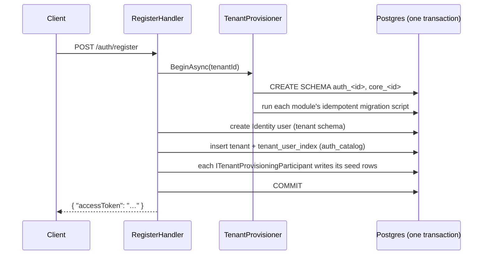

# ModularMonolith

A .NET 10 starter template for a **multi-tenant modular monolith**: one deployable API,
independently owned modules, and one Postgres database where every tenant gets its own
set of schemas.

Built on ASP.NET Core Minimal APIs, Wolverine, EF Core, PostgreSQL, and ASP.NET Identity.

---

## What you get

| Concern | Approach |
| --- | --- |
| Module boundaries | `IModule` seam — each module owns its DI registration, endpoints, entities, and migrations |
| Multi-tenancy | Schema per tenant **per module** (`auth_<tenantId>`, `core_<tenantId>`), selected at runtime |
| Tenant onboarding | Registration provisions the whole tenant in a **single Postgres transaction** |
| Request handling | Vertical slices: command/query + FluentValidation validator + static handler, dispatched by Wolverine |
| Auth | ASP.NET Identity (per tenant) + JWT bearer tokens carrying a `tenant_id` claim |
| Persistence | EF Core + Npgsql, one `DbContext` per module, snake_case everywhere |
| Errors | RFC 7807 `ProblemDetails` for validation, auth, and unique-constraint failures |
| Messaging infra | Wolverine with a Postgres-backed transactional outbox (`wolverine` schema) |
| Tests | 69 xUnit v3 + Shouldly unit tests, no Docker required |
| Tooling | `Makefile`, central package management, `.editorconfig`-enforced style, GitHub Actions CI |

---

## Layout

```
src/
  Api/ModularMonolith.Api/               Host: composes modules, auth, Wolverine, routing
  Modules/
    Auth/…Modules.Auth/                  Identity, JWT issuing, tenant registry, register/login
    Core/…Modules.Core/                  Employees + assignments (the sample business module)
  Shared/
    ModularMonolith.Shared.Infrastructure/   IModule, multi-tenancy, provisioning, EF helpers
    ModularMonolith.SharedKernel/            Dependency-free primitives (pagination)
tests/                                   Mirrors src/ — a module owns its own tests
scripts/                                 Generated SQL migration scripts
```

A module references `Shared.Infrastructure` and nothing else. Modules never reference each
other — cross-module work happens through interfaces defined in `Shared.Infrastructure`
(see [tenant provisioning](#tenant-provisioning) below).

---

## How it fits together

### Module composition

`Program.cs` holds the entire module list. Everything else is driven from it:

```csharp
IModule[] modules = [new AuthModule(), new CoreModule()];

foreach (var module in modules)
{
    module.AddModule(builder.Services, builder.Configuration);
}
```

Each module then maps its endpoints onto a shared, versioned route group
(`/api/v1`, set in exactly one place), and Wolverine discovers handlers and validators by
scanning each module's assembly.

### Multi-tenancy

Physical schemas are named `{modulePrefix}_{tenantId:D}` — e.g.
`auth_01a01672-43e5-7de8-98fb-3597d4e38de1`.

Schema selection happens **purely through Npgsql's `SearchPath` connection-string keyword**,
built per DI scope from `ITenantContext`. No `HasDefaultSchema`, nothing schema-qualified in
the models — so every generated migration is schema-agnostic and one script works for any
tenant.

`ITenantContext` resolves the current tenant in this order:

1. An explicit scope opened via `ITenantScopeFactory.CreateScope(tenantId)` (used by
   login and provisioning, which run outside a request principal).
2. The `tenant_id` claim on the JWT.
3. Otherwise it throws — there is no ambient default tenant.

Schema names contain hyphens, which are illegal in *unquoted* Postgres identifiers, so every
place a schema name becomes SQL routes through the single `TenantSchema.Quote()` helper.

### Tenant provisioning

`POST /auth/register` creates a whole tenant atomically. Postgres DDL is transactional, so
schema creation, migrations, and the first rows all commit or roll back together:



Modules join provisioning without Auth knowing they exist: implement
`ITenantProvisioningParticipant` and register it. `Core` does exactly this to seed the
registering user as an `Employee` (see
[EmployeeProvisioningParticipant.cs](src/Modules/Core/ModularMonolith.Modules.Core/Provisioning/EmployeeProvisioningParticipant.cs)).

### Login across tenants

Identity user tables live *inside* each tenant schema, so a plain email lookup would have
nowhere to start. A single global `auth_catalog` schema solves this: `tenant_user_index`
maps normalized email → tenant id + user id. Login reads the catalog, opens a tenant scope,
then verifies the password there. Users log in with email + password only — no tenant
selector in the UI.

### Vertical slices

One file per slice, holding the command, its validator, and a static handler:

```csharp
public sealed record CreateAssignmentCommand(Guid EmployeeId, string Title, string Description, DateTimeOffset? DueAt);

public sealed class CreateAssignmentCommandValidator : AbstractValidator<CreateAssignmentCommand> { … }

public static class CreateAssignmentHandler
{
    public static async Task<AssignmentResponse> Handle(CreateAssignmentCommand command, CoreDbContext core, …)
}
```

Validators are the slice's **preconditions** and run before the handler. They are registered
scoped, so they can inject a `DbContext` and do async database checks (`MustAsync`) — which
keeps existence and uniqueness checks out of the handler. A failed validation surfaces as a
400 with a `ValidationProblemDetails` body.

Endpoints stay one line each — they hand the message to `IMessageBus` and return the result.

---

## Getting started

**Prerequisites:** .NET 10 SDK, PostgreSQL, `make`.

```bash
git clone <this repo> && cd dotnet_modular_monolith
make setup          # copies .env.example → .env, restores packages and tools, builds
```

Then edit `.env` (it is git-ignored):

```ini
ASPNETCORE_ENVIRONMENT=Development
ASPNETCORE_URLS=http://localhost:8080
ConnectionStrings__Postgres=Host=localhost;Port=5432;Username=postgres;Password=…;Database=modular_monolith
Jwt__Issuer=modular-monolith
Jwt__Audience=modular-monolith
Jwt__SigningKey=<at least 32 random bytes>
Jwt__AccessTokenMinutes=60
```

Create the database, then apply the one-time `auth_catalog` bootstrap:

```bash
createdb modular_monolith
psql -d modular_monolith -f scripts/AuthCatalog-migration.sql
```

That is the only migration you apply by hand. Wolverine's own tables are created on first
boot, and tenant schemas are created during registration.

```bash
make run            # or: make watch  (hot reload)
```

### Try it

```bash
# Register — creates the tenant, its schemas, the user, and returns a token
curl -X POST http://localhost:8080/api/v1/auth/register \
  -H 'Content-Type: application/json' \
  -d '{"tenantName":"Acme","email":"ada@acme.com","password":"Sup3rSecret!","firstName":"Ada","lastName":"Lovelace"}'

# Log in later
curl -X POST http://localhost:8080/api/v1/auth/login \
  -H 'Content-Type: application/json' \
  -d '{"email":"ada@acme.com","password":"Sup3rSecret!"}'

# Use the token — the tenant_id claim decides which schemas you read and write
curl "http://localhost:8080/api/v1/assignments?page=1&pageSize=20" \
  -H "Authorization: Bearer $TOKEN"
```

### Endpoints

| Method | Route | Auth | Purpose |
| --- | --- | --- | --- |
| `POST` | `/api/v1/auth/register` | anonymous | Provision a tenant + first user, return an access token |
| `POST` | `/api/v1/auth/login` | anonymous | Exchange email + password for an access token |
| `POST` | `/api/v1/assignments` | bearer | Create an assignment for an employee |
| `GET` | `/api/v1/assignments` | bearer | Paged assignment list (`page`, `pageSize`; max 100) |

---

## Make targets

```
make help          Show this help
make setup         First-time setup: env + restore + build
make run           Run the API            (make run PORT=9000 CONFIG=Release)
make watch         Run with hot reload
make test          Run the test suite
make build         Build the solution     (make rebuild to clean first)
make format        Format code in place
make info          Show SDK version and projects
make outdated      List outdated NuGet packages
make clean         Remove bin/ and obj/
```

### Migrations

Authoring is scripted; **applying is deliberately manual** — there is no
`dotnet ef database update` anywhere in this repo. You review and run the SQL yourself.

```bash
# Author a migration for a module
make migrations-add MODULE=Core NAME=AddAssignmentTags

# The Auth module has a second DbContext (the global catalog)
make migrations-add MODULE=Auth NAME=AddSomething CONTEXT=AuthCatalog DIR=CatalogMigrations

# Generate an idempotent SQL script into scripts/
make migrations-script MODULE=Auth CONTEXT=AuthCatalog

# Undo the last migration
make migrations-remove MODULE=Core
```

Tenant-schema migrations never need a manual apply step: the provisioner generates the
script at runtime from the compiled model and runs it inside the registration transaction.
Only the global `auth_catalog` schema is applied by hand.

---

## Adding a module

1. Create `src/Modules/<Name>/ModularMonolith.Modules.<Name>`, referencing
   `Shared.Infrastructure` (and `SharedKernel` if needed). Add it to `ModularMonolith.slnx`
   and to the API project's `ProjectReference` list.
2. Add a `DbContext` that calls `modelBuilder.UseSnakeCaseNames()` at the end of
   `OnModelCreating`, plus an `IDesignTimeDbContextFactory` that routes through
   `ModuleDbContextServiceCollectionExtensions.UseSearchPath` — that shared helper is what
   keeps runtime DI and design-time tooling from drifting apart.
3. Implement `IModule`:
   ```csharp
   public sealed class WidgetsModule : IModule
   {
       public const string SchemaPrefix = "widgets";

       public string Name => "Widgets";

       public void AddModule(IServiceCollection services, IConfiguration configuration)
       {
           services.AddModuleDbContext<WidgetsDbContext>(configuration, SchemaPrefix);
       }

       public void MapEndpoints(IEndpointRouteBuilder endpoints)
       {
           WidgetsEndpoints.Map(endpoints);
       }
   }
   ```
4. Add it to the `modules` array in [Program.cs](src/Api/ModularMonolith.Api/Program.cs) and
   add `PROJECT_<Name>` to the `Makefile`.
5. Run `make migrations-add MODULE=<Name> NAME=Initial`. New tenants pick the module up
   automatically; existing tenants need the generated script run against each of their
   schemas.
6. Mirror the project under `tests/`.

Implement `ITenantProvisioningParticipant` if the module needs rows seeded when a tenant is
created.

---

## Testing

```bash
make test
```

69 unit tests (xUnit v3 + Shouldly) covering token issuing, password policy, validators,
the exception handler, tenant-context resolution, schema naming, and pagination. They run
without Docker or a database.

Validators that inject a `DbContext` stay unit-testable via
`TestValidateAsync(command, options => options.IncludeProperties(…))`, which runs only the
named properties so the database rule never executes.

Integration tests (handlers, provisioning rollback, schema isolation, EF translation) are
the next phase and are intentionally not here yet. The EF InMemory provider is deliberately
not used — it gives false confidence on exactly the paths that matter here.

---

## Conventions

Enforced by `.editorconfig` with `TreatWarningsAsErrors` and `EnforceCodeStyleInBuild`:

- **Block bodies** for methods, constructors, and operators — `{ }` with an explicit
  `return`, not `=>`. One-line properties and accessors may use expression bodies.
- **Primary constructors** for dependency injection.
- **snake_case in Postgres** for every table, column, index, and the EF history table
  (`__ef_migrations_history`).
- Minimal comments — the code carries the intent.

CI (GitHub Actions) runs restore → `dotnet format --verify-no-changes` → build → test on
every push and PR to `develop` and `main`.

---

## Invariants to preserve

Each of these is already wired up correctly. They are listed because breaking one **fails at
runtime rather than at build time**, so it is worth knowing they are load-bearing before you
change the code around them.

- **Quote every schema name.** Tenant schemas contain hyphens, which are illegal in unquoted
  Postgres identifiers. Any new code path that turns a schema name into SQL must go through
  `TenantSchema.Quote()`.
- **Keep types resolved by Wolverine handlers `public`.** An `internal` concrete type throws
  `InvalidServiceLocationException` on first dispatch, not at startup.
- **Keep `MigrationsSqlGenerationOptions.NoTransactions`** on the runtime script generation.
  Without it EF embeds `START TRANSACTION; … COMMIT;`, which commits the provisioning
  transaction early and silently breaks the all-or-nothing guarantee.
- **Keep `opts.UseRuntimeCompilation()`** and its package reference — Wolverine 6 no longer
  ships its runtime compiler by default and fails at startup without it.
- **Keep `MapInboundClaims = false`** on JWT bearer, or `sub` is rewritten to
  `ClaimTypes.NameIdentifier` and token subject reads break.
- **Call `UseSnakeCaseNames()` in every new `OnModelCreating`.** `EFCore.NamingConventions`
  only rewrites convention-derived names; anything using an explicit `ToTable(...)` — as
  ASP.NET Identity does — needs the extension to be renamed too.

---

## Not included

Refresh tokens, roles and permissions, and integration tests are out of scope for the
current phase.
